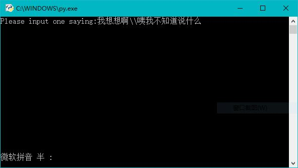
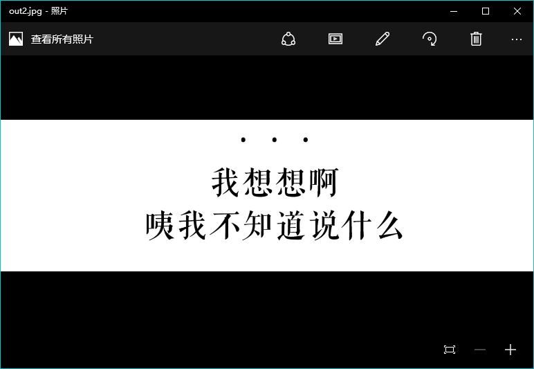

# One Saying Generator
A small Python program generating text as images

## What is One Saying Generator?

This is a simple python 3 program helping you generate text as images. By doing that,
you are allowed to publish beautiful texts in your wechat website.

After running it, input the texts you want to generate like this:

And then you will get a jpeg picture named as out.jpg like:

## How to Run it?

To run it, you just need to install the following software packages:

> [Python 3.5.2 for Windows](https://www.python.org/downloads/)
>
> [CTeX Packages](http://www.ctex.org/CTeXDownload)
>
> [imagemagick for Windows](http://www.imagemagick.org/script/binary-releases.php)

After successful installation of all the softwares above, you can run this gadget freely.

## Will I get any problem?

Of course you might get into trouble unexpectedly. One problem is that I cannot call the xelatex successfully by double click py file. The xelatex log showed that there were something wrong with the permission. But I can call the xelatex manually by using os.system() in IDLE. So I have to manually generate the pdf file by myself, and then run the py file again to generate jpg file. Maybe you can fix this bug.

## License

This program is with WTFPL License. For more info about that please refer to the LICENSE file.

